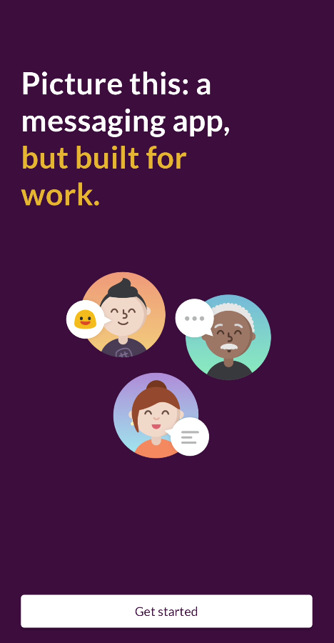
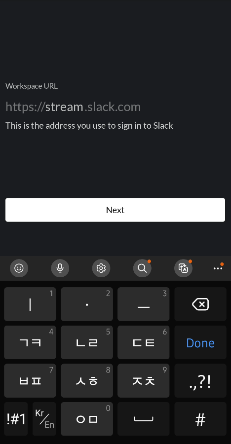
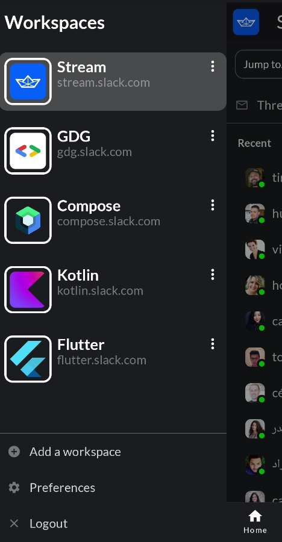
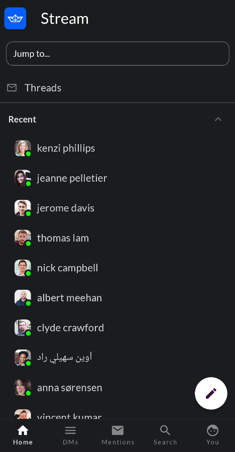
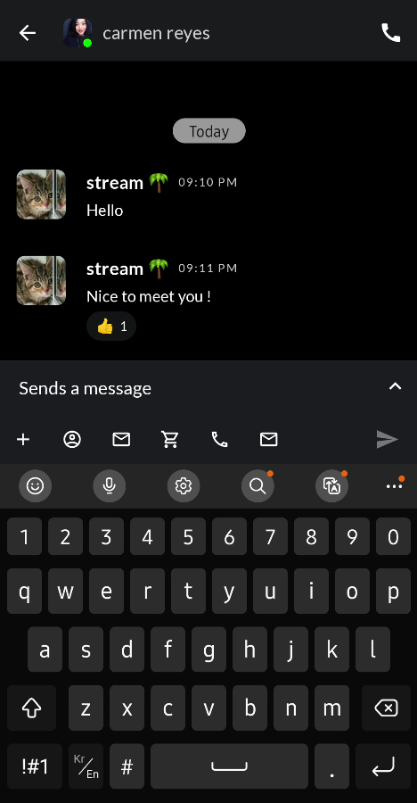
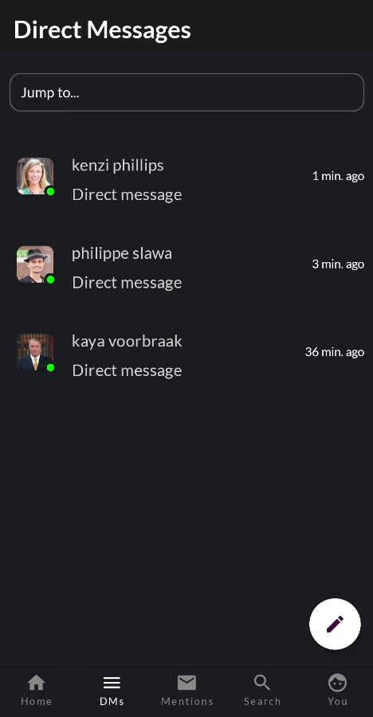
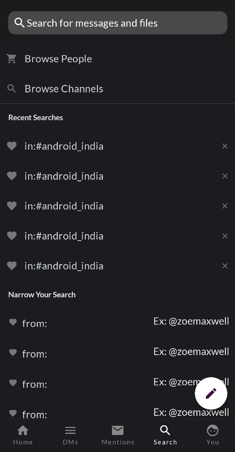
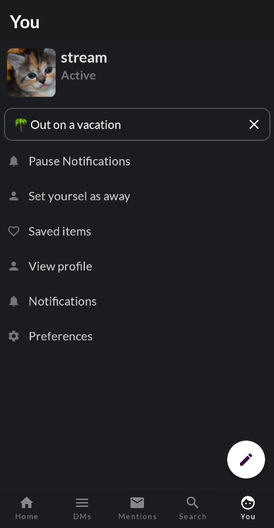
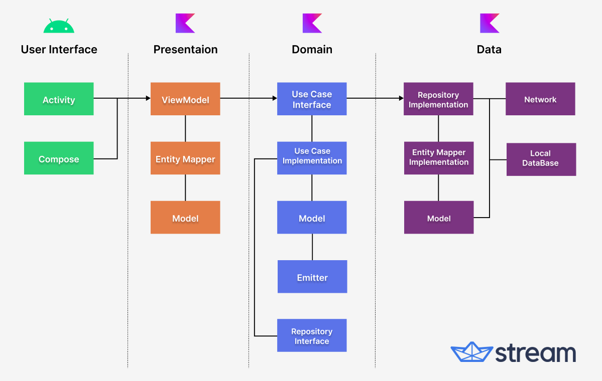

<p align="center">
  <a href="https://opensource.org/licenses/Apache-2.0"></a>
  <a href="https://android-arsenal.com/api?level=21"></a>
  <a href="https://github.com/GetStream/stream-slack-clone-android/actions/workflows/android.yml"></a>
</p>

This is a slack clone app built with Jetpack Compose and [Stream Chat SDK for Compose](https://getstream.io/chat/sdk/compose?utm_source=Github&utm_medium=Github_Repo_Content_Ad&utm_content=Developer&utm_campaign=Github_May2022_SlackAndroidClone&utm_term=DevRelOss) following clean architecture principles.

The purpose of this repository is to demonstrate below:

- Implementing entire UI elements with Jetpack Compose.
- Implementation of Android architecture components with Jetpack libraries such as Hilt.
- Performing background tasks with Kotlin Coroutines.
- Integrating chat systems with Stream Chat SDK for real-time event handling and authentication.

## Download
Go to the [Releases](https://github.com/GetStream/stream-slack-clone-android/releases) to download the latest APK.

<a href="https://getstream.io/chat/sdk/compose?utm_source=Github&utm_medium=Github_Repo_Content_Ad&utm_content=Developer&utm_campaign=Github_May2022_SlackAndroidClone&utm_term=DevRelOss">

</a>

## 🛥 Stream Chat SDK
Stream Slack Android clone was built with __[Stream Chat SDK for Compose](https://getstream.io/chat/sdk/compose?utm_source=Github&utm_medium=Github_Repo_Content_Ad&utm_content=Developer&utm_campaign=Github_May2022_SlackAndroidClone&utm_term=DevRelOss)__ to implement messaging systems.
If you’re interested in adding powerful In-App Messaging to your app, check out the __[Android Chat Messaging Tutorial](https://getstream.io/tutorials/android-chat?utm_source=Github&utm_medium=Github_Repo_Content_Ad&utm_content=Developer&utm_campaign=Github_May2022_SlackAndroidClone&utm_term=DevRelOss)__!

## 📷 Previews

<p align="center">









</p>

## 🛠 Tech Sacks & Open Source Libraries
- Minimum SDK level 21.
- 100% [Jetpack Compose](https://developer.android.com/jetpack/compose) based + [Coroutines](https://github.com/Kotlin/kotlinx.coroutines) + [Flow](https://kotlin.github.io/kotlinx.coroutines/kotlinx-coroutines-core/kotlinx.coroutines.flow/) for asynchronous.
- [Compose Chat SDK for Messaging](https://getstream.io/chat/sdk/compose?utm_source=Github&utm_medium=Github_Repo_Content_Ad&utm_content=Developer&utm_campaign=Github_May2022_SlackAndroidClone&utm_term=DevRelOss): The Jetpack Compose Chat Messaging SDK is built on a low-level chat client and provides modular, customizable Compose UI components that you can easily drop into your app.
- Jetpack
  - Compose: Android’s modern toolkit for building native UI.
  - Lifecycle: Observe lifecycle changes.
  - ViewModel: UI related data holder and lifecycle aware.
  - Room Persistence: Constructs Database by providing an abstraction layer over SQLite to allow fluent database access.
  - Paging3: Loads and displays pages of data from a larger dataset from local storage or over network.
  - App Startup: Provides a straightforward, performant way to initialize components at application startup.
- [Hilt](https://dagger.dev/hilt/): Dependency Injection.
- [Landscapist-Glide](https://github.com/skydoves/landscapist#glide): Jetpack Compose image loading library that fetches and displays network images with Glide, Coil, and Fresco.
- [Retrofit2 & OkHttp3](https://github.com/square/retrofit): Construct the REST APIs and paging network data.
- [Timber](https://github.com/JakeWharton/timber): A logger with a small, extensible API which provides utility.

## 🏛️ Architecture

Stream Slack Clone Android follows the principles of Clean Architecture with Android Architecture Components.

### Architecture's layers & boundaries:



- **User Interface Layer**: The responsibility of the UI layer is to render the application data on the screen. UI elements must be updated whenever the application data changes from user interaction or external communication with the network and database.
- **Presentation Layer**: The responsibility of the Presentation layer is to interact and notify data changes between UI layers and Domain layers. It also holds and restores data in configuration changes.
- **Domain Layer**: The domain layer is responsible for abstracting complex business logic and improving its reusability. This layer transforms the complex application data into suitable types for Presentation layers and groups similar business logic as a single feature.
- **Data Layer**: The responsibility of the data layer is to deliver the result of business logic executions, such as CRUD operations (Create, Retrieve, Update, Delete – all system events). This layer can be designed with various strategies, like Repository or DataSource, for dividing the responsibility of executions.

For more information, check out the [The 2022 Android Developer Roadmap: Part 3, Architecture Components](https://getstream.io/blog/android-developer-roadmap-part-3/#architecture-components).

### ✍️ Blog Post and Tutorial Video
We're planning to release a blog post and tutorial videos for the Stream Slack clone project. If you'd like to get notified as we release future posts, join the **[watchers](https://github.com/GetStream/stream-slack-clone-android/watchers)** on GitHub or follow **[Stream](https://twitter.com/getstream_io)** on Twitter. You can also follow the __[author](https://github.com/skydoves)__ of this repository on GitHub.

## 💯 MAD Score


## Credits

All copyrights of the resources, logo, branding, content, concepts, and phrases that are used in this open-source project belong to [Slack](https://slack.com/). Also, 
this project was forked from [SlackAndroidClone](https://github.com/Anmol92verma/SlackAndroidClone) and the original credit goes to [Anmol92verma](https://github.com/Anmol92verma).

 <a href="https://getstream.io/chat/sdk/compose?utm_source=Github&utm_medium=Github_Repo_Content_Ad&utm_content=Developer&utm_campaign=Github_May2022_SlackAndroidClone&utm_term=DevRelOss">
</a>

## Find this repository useful? 💙
Support it by joining __[stargazers](https://github.com/GetStream/stream-slack-clone-android/stargazers)__ for this repository. :star: <br>
Also, follow __[maintainers](https://github.com/skydoves)__ on GitHub for our next creations! 🤩

# License
```xml
Copyright 2022 Stream.IO, Inc. All Rights Reserved.

Licensed under the Apache License, Version 2.0 (the "License");
you may not use this file except in compliance with the License.
You may obtain a copy of the License at

   http://www.apache.org/licenses/LICENSE-2.0

Unless required by applicable law or agreed to in writing, software
distributed under the License is distributed on an "AS IS" BASIS,
WITHOUT WARRANTIES OR CONDITIONS OF ANY KIND, either express or implied.
See the License for the specific language governing permissions and
limitations under the License.
```
